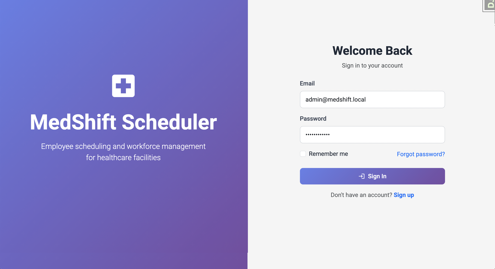

# MedShift Scheduler - User Manual

**Version:** 1.0.0 (MVP - Phase 1)  
**Last Updated:** October 10, 2025  
**For:** Healthcare Administrators, HR Managers, Department Heads

---

## Table of Contents

1. [Introduction](#1-introduction)
2. [Getting Started](#2-getting-started)
3. [Authentication](#3-authentication)
4. [Dashboard](#4-dashboard)
5. [Employee Management](#5-employee-management)
6. [Department Management](#6-department-management)
7. [Position Management](#7-position-management)
8. [Troubleshooting](#8-troubleshooting)
9. [FAQ](#9-faq)

---

## 1. Introduction

### 1.1 What is MedShift Scheduler?

MedShift Scheduler is a comprehensive employee scheduling and workforce management system designed specifically for healthcare facilities. It helps manage:

- Employee profiles and information
- Departments and organizational structure
- Job positions and roles
- Medical certifications (coming soon)
- Work schedules (coming soon)
- Time tracking (coming soon)

### 1.2 System Requirements

- **Browser:** Chrome 90+, Firefox 88+, Safari 14+, Edge 90+
- **Internet Connection:** Required
- **Screen Resolution:** 1280x720 minimum (1920x1080 recommended)
- **JavaScript:** Must be enabled

### 1.3 Who Should Use This Manual?

This manual is designed for:
- Healthcare administrators managing staff
- HR managers handling employee data
- Department heads overseeing their teams
- Clinic/hospital managers

---

## 2. Getting Started

### 2.1 Accessing the System

**URL:** `https://your-clinic-domain.com` (or your local installation URL)

**📸 INSERT SCREENSHOT:** Login page showing the MedShift logo and login form

### 2.2 Browser Compatibility

MedShift Scheduler works best with modern browsers:
- ✅ Google Chrome (recommended)
- ✅ Mozilla Firefox
- ✅ Microsoft Edge
- ✅ Safari

---

## 3. Authentication

### 3.1 Logging In

1. Navigate to the login page
2. Enter your **email address**
3. Enter your **password**
4. (Optional) Check **"Remember me"** to stay logged in
5. Click **"Sign In"**

**Default Credentials for New Employees:**
- **Email:** `yourname@clinic-domain.com`
- **Password:** `YourPassword` TODO: will be change

⚠️ **Security:** You will be prompted to change your password on first login.

### 3.2 Forgot Password

If you forget your password:

1. Click **"Forgot password?"** on the login page
2. Enter your email address
3. Click **"Send Reset Link"**
4. Check your email inbox
5. Click the reset link in the email
6. Enter your new password twice
7. Click **"Reset Password"**

**📸 INSERT SCREENSHOT:** Forgot password page

**📸 INSERT SCREENSHOT:** Password reset email example

**⏱️ Timeout:** Password reset links expire after **24 hours** for security.

### 3.3 Creating an Account (Admin Only)

Regular users cannot create their own accounts. Administrators create accounts through the **Employee Management** section.

### 3.4 Logging Out

To log out securely:

1. Click your **profile picture** (or initials) in the top-right corner
2. Select **"Logout"** from the dropdown menu

**📸 INSERT SCREENSHOT:** User menu dropdown showing Logout option

---

## 4. Dashboard

### 4.1 Overview

The Dashboard is your home page after logging in. It provides a quick overview of your workforce.

**📸 INSERT SCREENSHOT:** Full dashboard view with all widgets

### 4.2 Dashboard Widgets

#### Total Employees
Shows the number of active employees in your organization.

**📸 INSERT SCREENSHOT:** Total Employees widget

#### Today's Shifts
Displays scheduled shifts for today (coming soon).

#### Active Now
Shows employees currently clocked in (coming soon).

#### Certifications
Tracks medical certifications and licenses (coming soon).

### 4.3 System Information

Located on the right sidebar:
- **Version:** Current software version
- **Phase:** Development phase
- **Environment:** Development/Production
- **Database:** Database type

**📸 INSERT SCREENSHOT:** System Info card

### 4.4 Quick Links

Access frequently used pages:
- **Admin Panel:** Django admin interface (admin users only)
- **Manage Employees:** Direct link to employee list

**📸 INSERT SCREENSHOT:** Quick Links card

---

## 5. Employee Management

### 5.1 Viewing Employee List

To view all employees:

1. Click **"Employees"** in the left sidebar
2. You will see a list of all employees

**📸 INSERT SCREENSHOT:** Employee list page with filters and search

**List Columns:**
- **Employee ID:** Unique identifier (e.g., EMP1001)
- **Name:** Full name with profile picture
- **Department:** Department code and name
- **Position:** Job title
- **Type:** Employment type (Full-time, Part-time, etc.)
- **Hourly Rate:** Wage in CHF
- **Status:** Active/Inactive
- **Actions:** View/Edit buttons

### 5.2 Searching and Filtering Employees

#### Search Box
Type in the search box to find employees by:
- First name or last name
- Email address
- Employee ID

**📸 INSERT SCREENSHOT:** Search box highlighted

#### Filters

Use dropdown filters to narrow results:

1. **Department:** Filter by specific department
2. **Position:** Filter by job position
3. **Employment Type:** Full-time, Part-time, Contract, etc.
4. **Status:** Active or Inactive employees

**📸 INSERT SCREENSHOT:** Filter dropdowns

**Steps:**
1. Select filter options
2. Click **"Search"**
3. Click **"Clear"** to reset filters

### 5.3 Viewing Employee Details

To view detailed employee information:

1. Find the employee in the list
2. Click the **eye icon** (👁️) or click on their name
3. You will see the employee detail page with tabs

**📸 INSERT SCREENSHOT:** Employee detail page - Personal Info tab

#### Personal Information Tab

Displays:
- Profile picture
- Full name
- Email address
- Phone number
- Date of birth
- Country
- Emergency contact information

**📸 INSERT SCREENSHOT:** Personal Information tab

#### Work Information Tab

Shows employment details:
- Employee ID
- Employment type
- Department and position
- Hire date
- Years of service
- Hourly rate
- Weekly hours
- Status

**📸 INSERT SCREENSHOT:** Work Information tab

#### Documents Tab

Manage employee documents:
- Employment contracts
- Certifications
- Licenses
- Resumes
- Reference letters

**📸 INSERT SCREENSHOT:** Documents tab

### 5.4 Adding a New Employee

**👤 Permission Required:** Admin or HR Manager

To add a new employee:

1. Go to **Employees** page
2. Click **"Add Employee"** button (top-right)
3. Fill in the employee information form

**📸 INSERT SCREENSHOT:** Add Employee button highlighted

#### Personal Information Section

**Required fields (marked with *):**
- First Name
- Last Name
- Email Address

**Optional fields:**
- Profile Picture (JPG, PNG, GIF - max 5MB)
- Phone Number (Swiss format: +41 XX XXX XX XX)
- Date of Birth
- Country

**📸 INSERT SCREENSHOT:** Personal Information section of the form

#### Employment Information Section

**Required fields:**
- Employee ID (e.g., EMP1050)
- Department
- Position
- Employment Type
- Hire Date
- Hourly Rate (CHF)
- Weekly Hours

**Optional fields:**
- Termination Date
- Active Employee checkbox

**📸 INSERT SCREENSHOT:** Employment Information section

#### Emergency Contact Section

**Optional but recommended:**
- Contact Name
- Contact Phone
- Relationship (spouse, parent, etc.)

**📸 INSERT SCREENSHOT:** Emergency Contact section

#### Additional Notes

Use this section for internal notes about the employee.

**Steps to Complete:**

1. Fill in all required fields
2. Upload profile picture (optional)
3. Click **"Add Employee"** button
4. You will see a success message

**📸 INSERT SCREENSHOT:** Success message after adding employee

**🔐 Default Password:** All new employees receive the default password `Password123!` and should change it on first login.

### 5.5 Editing Employee Information

To edit an employee:

1. Find the employee in the list
2. Click the **pencil icon** (✏️) or go to their detail page
3. Click **"Edit"** button
4. Modify the information
5. Click **"Update Employee"**

**📸 INSERT SCREENSHOT:** Edit Employee form

**⚠️ Note:** Email address cannot be changed after account creation.

### 5.6 Uploading Employee Documents

To upload a document:

1. Go to employee detail page
2. Click **"Documents"** tab
3. Click **"Upload Document"** button
4. Fill in the form:
   - **Document Type:** Contract, Certificate, License, etc.
   - **Title:** Document name
   - **Description:** Brief description (optional)
   - **File:** Upload PDF, DOCX, JPG, or PNG
   - **Issue Date:** When document was issued
   - **Expiry Date:** When document expires (if applicable)
5. Click **"Upload Document"**

**📸 INSERT SCREENSHOT:** Document upload form

**Document Types:**
- Employment Contract
- Certification
- License
- Resume/CV
- Reference Letter
- Other

**📸 INSERT SCREENSHOT:** Documents list showing uploaded files

### 5.7 Deleting Employee Documents

To delete a document:

1. Go to employee detail page → Documents tab
2. Find the document
3. Click the **trash icon** (🗑️)
4. Confirm deletion

**⚠️ Warning:** Deleted documents cannot be recovered.

**📸 INSERT SCREENSHOT:** Document delete confirmation

### 5.8 Deactivating an Employee

To deactivate (not delete) an employee:

1. Edit the employee
2. Uncheck **"Active Employee"**
3. Set **"Termination Date"** (optional)
4. Click **"Update Employee"**

**📸 INSERT SCREENSHOT:** Active Employee checkbox unchecked

**💡 Best Practice:** Deactivate employees instead of deleting them to maintain historical records.

### 5.9 Deleting an Employee

**⚠️ WARNING:** This permanently deletes the employee, their user account, and all associated data.

To delete an employee:

1. Go to employee detail page
2. Click **"Delete"** button (red)
3. Confirm deletion

**📸 INSERT SCREENSHOT:** Delete confirmation dialog

**What gets deleted:**
- Employee profile
- User account
- All uploaded documents
- Time clock records (if any)

**💡 Recommendation:** Consider deactivating instead of deleting.

---

## 6. Department Management

### 6.1 Viewing Departments

To view all departments:

1. Click **"Departments"** in the left sidebar
2. You will see cards for each department

**📸 INSERT SCREENSHOT:** Department list page

**Department Card Information:**
- Department code (e.g., URG, CHIR)
- Department name
- Description
- Number of employees
- Department manager
- Active/Inactive status

**📸 INSERT SCREENSHOT:** Individual department card

### 6.2 Adding a Department

To add a new department:

1. Go to **Departments** page
2. Click **"Add Department"** button
3. Fill in the form:
   - **Department Name:** Full name (e.g., Emergency Department)
   - **Code:** Short code (e.g., URG)
   - **Description:** Brief description
   - **Manager:** Select from employee list (optional)
   - **Active:** Check if department is active
4. Click **"Save Department"**

**📸 INSERT SCREENSHOT:** Add Department form

**💡 Tip:** Use 2-4 letter codes for consistency (URG, CHIR, MED, etc.).

### 6.3 Editing a Department

To edit a department:

1. Find the department card
2. Click **"Edit"** button
3. Modify information
4. Click **"Save Department"**

**📸 INSERT SCREENSHOT:** Edit Department form

### 6.4 Deleting a Department

**⚠️ Restriction:** You cannot delete a department that has active employees.

To delete a department:

1. Ensure no active employees are assigned to it
2. Click **"Delete"** button on the department card
3. Confirm deletion

**📸 INSERT SCREENSHOT:** Department delete warning (with employees)

**If employees exist:** You must first reassign all employees to other departments.

---

## 7. Position Management

### 7.1 Viewing Positions

To view all job positions:

1. Click **"Positions"** in the left sidebar
2. You will see a table of all positions

**📸 INSERT SCREENSHOT:** Position list page

**Table Columns:**
- **Code:** Position code (e.g., RN, MD, PA)
- **Position Title:** Full job title
- **Hourly Rate Range:** Min-Max compensation in CHF
- **Certification Required:** Yes/No badge
- **Employees:** Number of employees in this position
- **Status:** Active/Inactive
- **Actions:** Edit/Delete buttons

### 7.2 Adding a Position

To add a new position:

1. Go to **Positions** page
2. Click **"Add Position"** button
3. Fill in the form:
   - **Position Title:** Full title (e.g., Registered Nurse)
   - **Code:** Short code (e.g., RN)
   - **Description:** Job description (optional)
   - **Requires Certification:** Check if medical license required
   - **Minimum Hourly Rate:** Minimum wage in CHF
   - **Maximum Hourly Rate:** Maximum wage in CHF
   - **Active:** Check if position is active
4. Click **"Save Position"**

**📸 INSERT SCREENSHOT:** Add Position form

**💡 Salary Guidelines:**
- Rates are in Swiss Francs (CHF) per hour
- Set realistic ranges based on Swiss healthcare standards
- Maximum rate must be greater than minimum rate

### 7.3 Editing a Position

To edit a position:

1. Find the position in the table
2. Click the **pencil icon** (✏️)
3. Modify information
4. Click **"Save Position"**

**📸 INSERT SCREENSHOT:** Edit Position form

### 7.4 Deleting a Position

**⚠️ Restriction:** You cannot delete a position that has active employees.

To delete a position:

1. Ensure no active employees have this position
2. Click the **trash icon** (🗑️)
3. Confirm deletion

**📸 INSERT SCREENSHOT:** Position delete warning (with employees)

---

## 8. Troubleshooting

### 8.1 Common Issues

#### Cannot Log In

**Problem:** "Invalid email or password" error

**Solutions:**
1. Check that Caps Lock is OFF
2. Verify you're using the correct email
3. Try the "Forgot Password" link
4. Contact your administrator

#### Profile Picture Not Uploading

**Problem:** Image won't upload

**Solutions:**
1. Check file size (must be under 5MB)
2. Use JPG, PNG, or GIF format
3. Try a different browser
4. Clear browser cache

#### Changes Not Saving

**Problem:** Form doesn't submit

**Solutions:**
1. Check for red error messages on the form
2. Ensure all required fields (marked with *) are filled
3. Check your internet connection
4. Try refreshing the page and re-entering data

#### Can't Delete Department/Position

**Problem:** "Cannot delete" error

**Solution:** You must first reassign all employees to different departments/positions before deleting.

### 8.2 Browser Cache Issues

If you see old data or styling issues:

**Chrome/Edge:**
1. Press `Ctrl+Shift+Del` (Windows) or `Cmd+Shift+Del` (Mac)
2. Select "Cached images and files"
3. Click "Clear data"

**Firefox:**
1. Press `Ctrl+Shift+Del`
2. Select "Cache"
3. Click "Clear Now"

**Safari:**
1. Go to Safari → Preferences → Advanced
2. Check "Show Develop menu"
3. Develop → Empty Caches

### 8.3 Performance Issues

If the system is slow:

1. Close unnecessary browser tabs
2. Clear browser cache (see above)
3. Check your internet speed
4. Try a different browser
5. Contact IT support

---

## 9. FAQ

### Q: Can I change my email address?

**A:** No, email addresses cannot be changed after account creation for security reasons. Contact your administrator if you need to change your email.

### Q: What's the default password for new employees?

**A:** All new employees receive the password `Password123!` and should change it immediately upon first login.

### Q: Can I export employee data to Excel?

**A:** This feature is coming in Phase 2. Currently, you can view and print employee lists from your browser.

### Q: How do I assign employees to shifts?

**A:** The Schedule Management module is coming soon in Phase 2.

### Q: Can employees clock in/out through the system?

**A:** The Time Clock module is coming soon in Phase 2.

### Q: What happens to employee data when I deactivate them?

**A:** Deactivating an employee keeps all their historical data but removes them from active lists. They cannot log in when deactivated.

### Q: What happens when I delete an employee?

**A:** **Permanent deletion** removes the employee profile, user account, all documents, and time records. This cannot be undone. We recommend deactivating instead.

### Q: Can I bulk import employees from a spreadsheet?

**A:** Bulk import functionality is planned for Phase 2.

### Q: What certifications can I track?

**A:** Currently, you can upload certification documents manually. Automated certification tracking and expiry alerts are coming in Phase 1.5.

### Q: Is my data secure?

**A:** Yes. The system uses:
- Encrypted passwords
- HTTPS for all communications
- Role-based access control
- Regular database backups (in production)

### Q: Who can I contact for help?

**A:** Contact your system administrator or IT support team:
- Email: support@your-clinic.com
- Phone: +41 XX XXX XX XX

### Q: Can I access the system from my phone?

**A:** Yes! The system is mobile-responsive and works on tablets and smartphones. However, the full desktop experience is recommended for administrative tasks.

---

## Appendix A: Glossary

- **Active Employee:** An employee currently employed and able to log in
- **CHF:** Swiss Franc - the Swiss currency
- **Department:** An organizational unit (e.g., Emergency, Surgery)
- **Employee ID:** Unique identifier assigned to each employee
- **Employment Type:** Full-time, Part-time, Contract, Temporary, or Intern
- **Hourly Rate:** Wage paid per hour in Swiss Francs
- **Position:** Job role or title (e.g., Registered Nurse, Doctor)
- **Profile Picture:** Employee photo displayed in the system

---

## Appendix B: Keyboard Shortcuts

| Shortcut | Action |
|----------|--------|
| `Ctrl + K` | Focus search box (when on employee list) |
| `Esc` | Close modal dialogs |
| `Tab` | Move to next form field |
| `Shift + Tab` | Move to previous form field |

---

## Appendix C: Contact Information

**Technical Support:**
- Email: support@medshift.local
- Phone: +41 XX XXX XX XX
- Hours: Monday-Friday, 8:00-17:00 (CET)

**For Feature Requests:**
- Email: feedback@medshift.local

**For Security Issues:**
- Email: security@medshift.local
- **⚠️ Urgent:** Call +41 XX XXX XX XX immediately

---

## Document Information

**Document Version:** 1.0.0  
**Last Updated:** October 10, 2025  
**Prepared By:** MedShift Development Team  
**Approved By:** Clinical Administrator  

**Revision History:**

| Version | Date | Changes | Author |
|---------|------|---------|--------|
| 1.0.0 | Oct 10, 2025 | Initial release | Dev Team |

---

**© 2025 Trident Software Sarl. All rights reserved.**